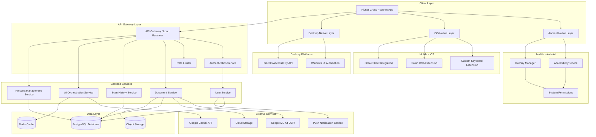
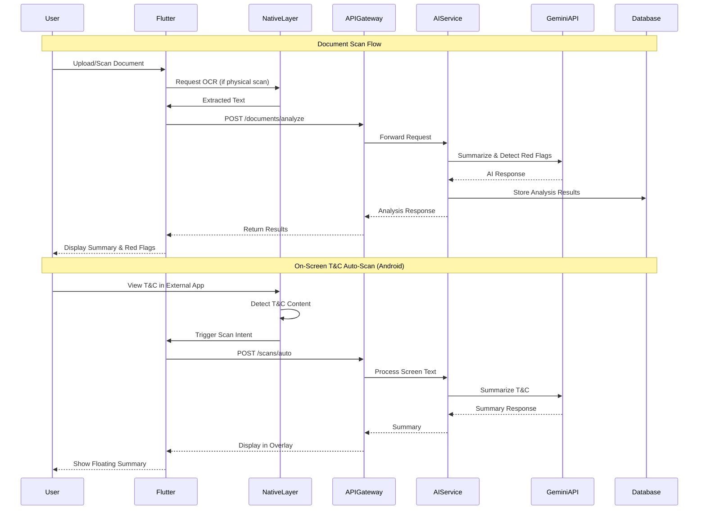
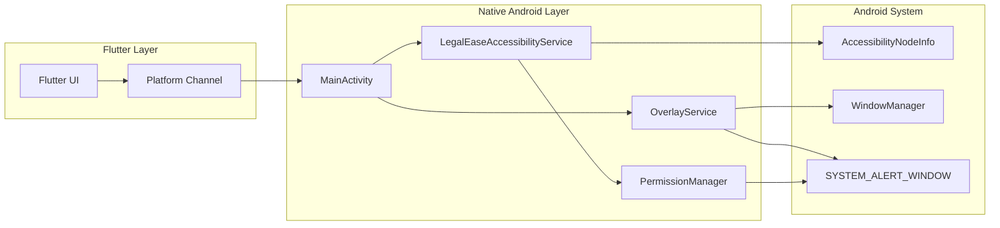
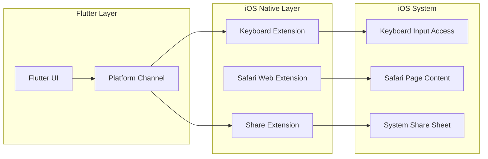
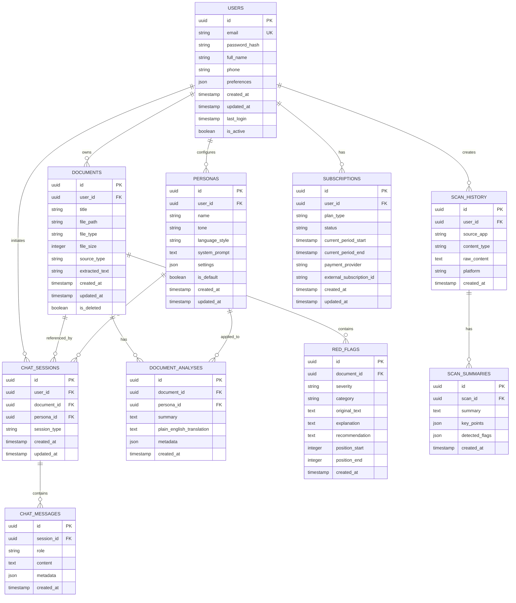

# Module/Master Design Document (MDD)
## LegalEase - AI Legal Assistant Platform

**Document Version:** 1.0  
**Last Updated:** February 21, 2026  
**Status:** Draft  

---

## Table of Contents

1. [High-Level System Architecture](#1-high-level-system-architecture)
2. [Database Schema](#2-database-schema)
3. [Data Models](#3-data-models)
4. [API Endpoints](#4-api-endpoints)

---

## 1. High-Level System Architecture

### 1.1 System Overview

LegalEase is a cross-platform AI legal assistant built on a hybrid architecture combining Flutter for cross-platform UI, native platform services for accessibility features, and Google Gemini API for AI processing.

### 1.2 Architecture Diagram



### 1.3 Component Interaction Flow



### 1.4 Platform-Specific Architecture Details

#### 1.4.1 Android Architecture



**Key Android Components:**
- **LegalEaseAccessibilityService**: Extends `AccessibilityService`, traverses `AccessibilityNodeInfo` to extract text from any visible app
- **OverlayService**: Uses `SYSTEM_ALERT_WINDOW` permission to render floating UI over other apps
- **Platform Channel**: MethodChannel communication between Flutter and native Kotlin/Java code

#### 1.4.2 iOS Architecture



**iOS Constraints & Workarounds:**
- Apple sandboxing prevents global accessibility scanning
- **Keyboard Extension**: Monitors text input in any app through custom keyboard
- **Safari Web Extension**: Reads page content when user activates extension in Safari
- **Share Extension**: User manually shares T&C text to LegalEase

### 1.5 Technology Stack Summary

| Layer | Technology | Purpose |
|-------|------------|---------|
| Mobile UI | Flutter (Dart) | Cross-platform UI framework |
| Android Native | Kotlin/Java | AccessibilityService, Overlay management |
| iOS Native | Swift | Keyboard Extension, Safari Extension |
| Desktop (Windows) | C# / .NET | UI Automation API |
| Desktop (macOS) | Swift | Accessibility API |
| Backend | Node.js / Python [REQUIRES CLARIFICATION] | API services |
| API Gateway | Kong / AWS API Gateway [REQUIRES CLARIFICATION] | Request routing, rate limiting |
| Database | PostgreSQL | Primary data store |
| Cache | Redis | Session cache, response caching |
| Object Storage | AWS S3 / Google Cloud Storage [REQUIRES CLARIFICATION] | Document storage |
| AI Engine | Google Gemini API | Summarization, generation, chat |
| OCR | Google ML Kit | Physical document text extraction |

---

## 2. Database Schema

### 2.1 Entity Relationship Diagram



### 2.2 SQL Schema Definition

```sql
-- Users Table
CREATE TABLE users (
    id UUID PRIMARY KEY DEFAULT gen_random_uuid(),
    email VARCHAR(255) UNIQUE NOT NULL,
    password_hash VARCHAR(255) NOT NULL,
    full_name VARCHAR(255),
    phone VARCHAR(50),
    preferences JSONB DEFAULT '{}',
    created_at TIMESTAMP WITH TIME ZONE DEFAULT CURRENT_TIMESTAMP,
    updated_at TIMESTAMP WITH TIME ZONE DEFAULT CURRENT_TIMESTAMP,
    last_login TIMESTAMP WITH TIME ZONE,
    is_active BOOLEAN DEFAULT true
);

-- Documents Table
CREATE TABLE documents (
    id UUID PRIMARY KEY DEFAULT gen_random_uuid(),
    user_id UUID NOT NULL REFERENCES users(id) ON DELETE CASCADE,
    title VARCHAR(500),
    file_path VARCHAR(1000),
    file_type VARCHAR(50),
    file_size INTEGER,
    source_type VARCHAR(50) NOT NULL, -- 'upload', 'scan', 'screen_capture', 'share_extension'
    extracted_text TEXT,
    created_at TIMESTAMP WITH TIME ZONE DEFAULT CURRENT_TIMESTAMP,
    updated_at TIMESTAMP WITH TIME ZONE DEFAULT CURRENT_TIMESTAMP,
    is_deleted BOOLEAN DEFAULT false
);

-- Document Analyses Table
CREATE TABLE document_analyses (
    id UUID PRIMARY KEY DEFAULT gen_random_uuid(),
    document_id UUID NOT NULL REFERENCES documents(id) ON DELETE CASCADE,
    persona_id UUID REFERENCES personas(id) ON DELETE SET NULL,
    summary TEXT,
    plain_english_translation TEXT,
    metadata JSONB DEFAULT '{}',
    created_at TIMESTAMP WITH TIME ZONE DEFAULT CURRENT_TIMESTAMP
);

-- Red Flags Table
CREATE TABLE red_flags (
    id UUID PRIMARY KEY DEFAULT gen_random_uuid(),
    document_id UUID NOT NULL REFERENCES documents(id) ON DELETE CASCADE,
    severity VARCHAR(20) NOT NULL, -- 'low', 'medium', 'high', 'critical'
    category VARCHAR(100), -- 'hidden_fees', 'termination_clause', 'liability', etc.
    original_text TEXT NOT NULL,
    explanation TEXT NOT NULL,
    recommendation TEXT,
    position_start INTEGER,
    position_end INTEGER,
    created_at TIMESTAMP WITH TIME ZONE DEFAULT CURRENT_TIMESTAMP
);

-- Scan History Table
CREATE TABLE scan_history (
    id UUID PRIMARY KEY DEFAULT gen_random_uuid(),
    user_id UUID NOT NULL REFERENCES users(id) ON DELETE CASCADE,
    source_app VARCHAR(255),
    content_type VARCHAR(50), -- 'terms_conditions', 'privacy_policy', 'eula', 'contract'
    raw_content TEXT NOT NULL,
    platform VARCHAR(50) NOT NULL, -- 'android', 'ios', 'web', 'desktop'
    created_at TIMESTAMP WITH TIME ZONE DEFAULT CURRENT_TIMESTAMP
);

-- Scan Summaries Table
CREATE TABLE scan_summaries (
    id UUID PRIMARY KEY DEFAULT gen_random_uuid(),
    scan_id UUID NOT NULL REFERENCES scan_history(id) ON DELETE CASCADE,
    summary TEXT,
    key_points JSONB DEFAULT '[]',
    detected_flags JSONB DEFAULT '[]',
    created_at TIMESTAMP WITH TIME ZONE DEFAULT CURRENT_TIMESTAMP
);

-- Personas Table
CREATE TABLE personas (
    id UUID PRIMARY KEY DEFAULT gen_random_uuid(),
    user_id UUID NOT NULL REFERENCES users(id) ON DELETE CASCADE,
    name VARCHAR(100) NOT NULL,
    tone VARCHAR(50) NOT NULL, -- 'formal', 'casual', 'aggressive', 'polite'
    language_style VARCHAR(50), -- 'plain_english', 'semi_formal', 'corporate'
    system_prompt TEXT,
    settings JSONB DEFAULT '{}',
    is_default BOOLEAN DEFAULT false,
    created_at TIMESTAMP WITH TIME ZONE DEFAULT CURRENT_TIMESTAMP,
    updated_at TIMESTAMP WITH TIME ZONE DEFAULT CURRENT_TIMESTAMP
);

-- Subscriptions Table
CREATE TABLE subscriptions (
    id UUID PRIMARY KEY DEFAULT gen_random_uuid(),
    user_id UUID NOT NULL REFERENCES users(id) ON DELETE CASCADE,
    plan_type VARCHAR(50) NOT NULL, -- 'free', 'premium', 'enterprise'
    status VARCHAR(50) NOT NULL, -- 'active', 'cancelled', 'expired', 'past_due'
    current_period_start TIMESTAMP WITH TIME ZONE,
    current_period_end TIMESTAMP WITH TIME ZONE,
    payment_provider VARCHAR(50), -- 'stripe', 'apple', 'google'
    external_subscription_id VARCHAR(255),
    created_at TIMESTAMP WITH TIME ZONE DEFAULT CURRENT_TIMESTAMP,
    updated_at TIMESTAMP WITH TIME ZONE DEFAULT CURRENT_TIMESTAMP
);

-- Chat Sessions Table
CREATE TABLE chat_sessions (
    id UUID PRIMARY KEY DEFAULT gen_random_uuid(),
    user_id UUID NOT NULL REFERENCES users(id) ON DELETE CASCADE,
    document_id UUID REFERENCES documents(id) ON DELETE SET NULL,
    persona_id UUID REFERENCES personas(id) ON DELETE SET NULL,
    session_type VARCHAR(50) NOT NULL, -- 'document_qa', 'writing_assistant', 'general'
    created_at TIMESTAMP WITH TIME ZONE DEFAULT CURRENT_TIMESTAMP,
    updated_at TIMESTAMP WITH TIME ZONE DEFAULT CURRENT_TIMESTAMP
);

-- Chat Messages Table
CREATE TABLE chat_messages (
    id UUID PRIMARY KEY DEFAULT gen_random_uuid(),
    session_id UUID NOT NULL REFERENCES chat_sessions(id) ON DELETE CASCADE,
    role VARCHAR(20) NOT NULL, -- 'user', 'assistant', 'system'
    content TEXT NOT NULL,
    metadata JSONB DEFAULT '{}',
    created_at TIMESTAMP WITH TIME ZONE DEFAULT CURRENT_TIMESTAMP
);

-- Indexes
CREATE INDEX idx_documents_user_id ON documents(user_id);
CREATE INDEX idx_documents_created_at ON documents(created_at DESC);
CREATE INDEX idx_document_analyses_document_id ON document_analyses(document_id);
CREATE INDEX idx_red_flags_document_id ON red_flags(document_id);
CREATE INDEX idx_red_flags_severity ON red_flags(severity);
CREATE INDEX idx_scan_history_user_id ON scan_history(user_id);
CREATE INDEX idx_scan_history_created_at ON scan_history(created_at DESC);
CREATE INDEX idx_personas_user_id ON personas(user_id);
CREATE INDEX idx_subscriptions_user_id ON subscriptions(user_id);
CREATE INDEX idx_chat_sessions_user_id ON chat_sessions(user_id);
CREATE INDEX idx_chat_messages_session_id ON chat_messages(session_id);
```

---

## 3. Data Models

### 3.1 Core Models

#### 3.1.1 User Model

```json
{
  "id": "uuid",
  "email": "string",
  "fullName": "string",
  "phone": "string | null",
  "preferences": {
    "defaultPersonaId": "uuid | null",
    "notificationSettings": {
      "emailNotifications": "boolean",
      "pushNotifications": "boolean",
      "scanAlerts": "boolean"
    },
    "displaySettings": {
      "theme": "light | dark | system",
      "fontSize": "small | medium | large",
      "language": "string"
    },
    "privacySettings": {
      "saveScanHistory": "boolean",
      "shareUsageData": "boolean"
    }
  },
  "subscription": {
    "planType": "free | premium | enterprise",
    "status": "active | cancelled | expired",
    "currentPeriodEnd": "timestamp | null"
  },
  "createdAt": "timestamp",
  "updatedAt": "timestamp",
  "lastLogin": "timestamp | null",
  "isActive": "boolean"
}
```

#### 3.1.2 Document Model

```json
{
  "id": "uuid",
  "userId": "uuid",
  "title": "string",
  "filePath": "string | null",
  "fileType": "pdf | docx | txt | image",
  "fileSize": "integer",
  "sourceType": "upload | scan | screen_capture | share_extension",
  "extractedText": "string",
  "analysis": {
    "id": "uuid",
    "summary": "string",
    "plainEnglishTranslation": "string",
    "metadata": {
      "documentType": "string",
      "wordCount": "integer",
      "processingTime": "integer",
      "modelVersion": "string"
    },
    "createdAt": "timestamp"
  },
  "redFlags": [
    {
      "id": "uuid",
      "severity": "low | medium | high | critical",
      "category": "string",
      "originalText": "string",
      "explanation": "string",
      "recommendation": "string",
      "position": {
        "start": "integer",
        "end": "integer"
      }
    }
  ],
  "createdAt": "timestamp",
  "updatedAt": "timestamp",
  "isDeleted": "boolean"
}
```

#### 3.1.3 Scan History Model

```json
{
  "id": "uuid",
  "userId": "uuid",
  "sourceApp": "string | null",
  "contentType": "terms_conditions | privacy_policy | eula | contract | other",
  "rawContent": "string",
  "platform": "android | ios | web | desktop",
  "summary": {
    "id": "uuid",
    "summary": "string",
    "keyPoints": [
      {
        "point": "string",
        "importance": "high | medium | low"
      }
    ],
    "detectedFlags": [
      {
        "type": "string",
        "description": "string",
        "severity": "low | medium | high | critical"
      }
    ],
    "createdAt": "timestamp"
  },
  "createdAt": "timestamp"
}
```

#### 3.1.4 Persona Model

```json
{
  "id": "uuid",
  "userId": "uuid",
  "name": "string",
  "tone": "formal | casual | aggressive | polite | professional",
  "languageStyle": "plain_english | semi_formal | corporate | academic",
  "systemPrompt": "string",
  "settings": {
    "responseLength": "concise | moderate | detailed",
    "includeExplanations": "boolean",
    "legalCitationStyle": "none | basic | full",
    "riskTolerance": "conservative | moderate | aggressive"
  },
  "isDefault": "boolean",
  "createdAt": "timestamp",
  "updatedAt": "timestamp"
}
```

#### 3.1.5 Chat Session Model

```json
{
  "id": "uuid",
  "userId": "uuid",
  "documentId": "uuid | null",
  "personaId": "uuid | null",
  "sessionType": "document_qa | writing_assistant | general",
  "messages": [
    {
      "id": "uuid",
      "role": "user | assistant | system",
      "content": "string",
      "metadata": {
        "tokens": "integer",
        "modelUsed": "string",
        "processingTime": "integer"
      },
      "createdAt": "timestamp"
    }
  ],
  "createdAt": "timestamp",
  "updatedAt": "timestamp"
}
```

### 3.2 Request/Response Models

#### 3.2.1 Document Analysis Request

```json
{
  "documentId": "uuid",
  "options": {
    "personaId": "uuid | null",
    "analysisTypes": [
      "summary",
      "red_flags",
      "plain_english",
      "key_terms"
    ],
    "redFlagCategories": [
      "hidden_fees",
      "termination_clauses",
      "liability",
      "data_collection",
      "auto_renewal",
      "arbitration"
    ]
  }
}
```

#### 3.2.2 Document Analysis Response

```json
{
  "analysisId": "uuid",
  "documentId": "uuid",
  "summary": "string",
  "plainEnglishTranslation": "string",
  "keyTerms": [
    {
      "term": "string",
      "definition": "string",
      "context": "string"
    }
  ],
  "redFlags": [
    {
      "id": "uuid",
      "severity": "low | medium | high | critical",
      "category": "string",
      "originalText": "string",
      "explanation": "string",
      "recommendation": "string",
      "position": {
        "start": "integer",
        "end": "integer"
      }
    }
  ],
  "metadata": {
    "processingTime": "integer",
    "modelVersion": "string",
    "confidenceScore": "number"
  },
  "createdAt": "timestamp"
}
```

#### 3.2.3 Auto-Scan Request (On-Screen T&C)

```json
{
  "content": "string",
  "metadata": {
    "sourceApp": "string",
    "contentType": "terms_conditions | privacy_policy | eula",
    "platform": "android | ios | web | desktop",
    "url": "string | null"
  },
  "options": {
    "personaId": "uuid | null",
    "summaryLength": "brief | standard | detailed"
  }
}
```

#### 3.2.4 Auto-Scan Response

```json
{
  "scanId": "uuid",
  "summary": "string",
  "keyPoints": [
    {
      "point": "string",
      "importance": "high | medium | low",
      "category": "string"
    }
  ],
  "redFlags": [
    {
      "severity": "low | medium | high | critical",
      "type": "string",
      "description": "string",
      "originalText": "string"
    }
  ],
  "recommendation": {
    "action": "accept | review | reject",
    "reasoning": "string"
  },
  "processingTime": "integer"
}
```

#### 3.2.5 Writing Assistant Request

```json
{
  "text": "string",
  "context": {
    "documentType": "email | contract | letter | negotiation",
    "recipient": "individual | business | legal_counsel"
  },
  "personaId": "uuid | null",
  "suggestions": [
    "clarity_improvement",
    "legal_accuracy",
    "tone_adjustment",
    "risk_reduction"
  ]
}
```

#### 3.2.6 Writing Assistant Response

```json
{
  "suggestions": [
    {
      "id": "uuid",
      "type": "clarity_improvement | legal_accuracy | tone_adjustment | risk_reduction",
      "originalText": "string",
      "suggestedText": "string",
      "explanation": "string",
      "position": {
        "start": "integer",
        "end": "integer"
      },
      "confidence": "number"
    }
  ],
  "overallScore": {
    "clarity": "number",
    "legalSoundness": "number",
    "tone": "number"
  },
  "personaApplied": {
    "id": "uuid",
    "name": "string"
  }
}
```

---

## 4. API Endpoints

### 4.1 API Overview

All API endpoints use RESTful conventions with JSON request/response bodies. Base URL: `https://api.legalease.com/v1`

**Authentication:** Bearer token (JWT) in Authorization header  
**Rate Limiting:** [REQUIRES CLARIFICATION - per-tier limits]  
**Content-Type:** `application/json`

---

### 4.2 Authentication Endpoints

#### 4.2.1 Register User

```
POST /auth/register
```

**Request:**
```json
{
  "email": "string",
  "password": "string",
  "fullName": "string",
  "phone": "string | null"
}
```

**Response (201):**
```json
{
  "user": {
    "id": "uuid",
    "email": "string",
    "fullName": "string",
    "createdAt": "timestamp"
  },
  "tokens": {
    "accessToken": "string",
    "refreshToken": "string",
    "expiresIn": "integer"
  }
}
```

**Error Response (400):**
```json
{
  "error": {
    "code": "VALIDATION_ERROR",
    "message": "string",
    "details": [
      {
        "field": "string",
        "message": "string"
      }
    ]
  }
}
```

#### 4.2.2 Login

```
POST /auth/login
```

**Request:**
```json
{
  "email": "string",
  "password": "string",
  "deviceInfo": {
    "platform": "android | ios | web | desktop",
    "deviceId": "string",
    "pushToken": "string | null"
  }
}
```

**Response (200):**
```json
{
  "user": {
    "id": "uuid",
    "email": "string",
    "fullName": "string",
    "preferences": {},
    "subscription": {
      "planType": "string",
      "status": "string"
    }
  },
  "tokens": {
    "accessToken": "string",
    "refreshToken": "string",
    "expiresIn": "integer"
  }
}
```

#### 4.2.3 Refresh Token

```
POST /auth/refresh
```

**Request:**
```json
{
  "refreshToken": "string"
}
```

**Response (200):**
```json
{
  "accessToken": "string",
  "expiresIn": "integer"
}
```

#### 4.2.4 Logout

```
POST /auth/logout
```

**Headers:** `Authorization: Bearer <token>`

**Response (200):**
```json
{
  "message": "Successfully logged out"
}
```

---

### 4.3 User Endpoints

#### 4.3.1 Get Current User

```
GET /users/me
```

**Headers:** `Authorization: Bearer <token>`

**Response (200):**
```json
{
  "id": "uuid",
  "email": "string",
  "fullName": "string",
  "phone": "string | null",
  "preferences": {
    "defaultPersonaId": "uuid | null",
    "notificationSettings": {},
    "displaySettings": {},
    "privacySettings": {}
  },
  "subscription": {
    "planType": "string",
    "status": "string",
    "currentPeriodEnd": "timestamp | null"
  },
  "createdAt": "timestamp",
  "lastLogin": "timestamp | null"
}
```

#### 4.3.2 Update User Profile

```
PATCH /users/me
```

**Headers:** `Authorization: Bearer <token>`

**Request:**
```json
{
  "fullName": "string",
  "phone": "string | null",
  "preferences": {
    "notificationSettings": {},
    "displaySettings": {},
    "privacySettings": {}
  }
}
```

**Response (200):**
```json
{
  "id": "uuid",
  "email": "string",
  "fullName": "string",
  "phone": "string | null",
  "preferences": {},
  "updatedAt": "timestamp"
}
```

#### 4.3.3 Delete User Account

```
DELETE /users/me
```

**Headers:** `Authorization: Bearer <token>`

**Response (200):**
```json
{
  "message": "Account deleted successfully",
  "deletedAt": "timestamp"
}
```

---

### 4.4 Document Endpoints

#### 4.4.1 Upload Document

```
POST /documents
```

**Headers:** 
- `Authorization: Bearer <token>`
- `Content-Type: multipart/form-data`

**Request (multipart):**
- `file`: binary file
- `title`: string (optional)
- `sourceType`: "upload" | "scan"

**Response (201):**
```json
{
  "id": "uuid",
  "userId": "uuid",
  "title": "string",
  "filePath": "string",
  "fileType": "string",
  "fileSize": "integer",
  "sourceType": "string",
  "extractedText": "string | null",
  "createdAt": "timestamp"
}
```

#### 4.4.2 List Documents

```
GET /documents?page=1&limit=20&sortBy=createdAt&sortOrder=desc
```

**Headers:** `Authorization: Bearer <token>`

**Query Parameters:**
- `page`: integer (default: 1)
- `limit`: integer (default: 20, max: 100)
- `sortBy`: "createdAt" | "title" | "fileSize"
- `sortOrder`: "asc" | "desc"
- `sourceType`: string (optional filter)

**Response (200):**
```json
{
  "documents": [
    {
      "id": "uuid",
      "title": "string",
      "fileType": "string",
      "fileSize": "integer",
      "sourceType": "string",
      "createdAt": "timestamp",
      "hasAnalysis": "boolean",
      "redFlagCount": "integer"
    }
  ],
  "pagination": {
    "page": "integer",
    "limit": "integer",
    "total": "integer",
    "totalPages": "integer"
  }
}
```

#### 4.4.3 Get Document

```
GET /documents/:documentId
```

**Headers:** `Authorization: Bearer <token>`

**Response (200):**
```json
{
  "id": "uuid",
  "userId": "uuid",
  "title": "string",
  "filePath": "string",
  "fileType": "string",
  "fileSize": "integer",
  "sourceType": "string",
  "extractedText": "string",
  "analysis": {
    "id": "uuid",
    "summary": "string",
    "plainEnglishTranslation": "string",
    "metadata": {},
    "createdAt": "timestamp"
  },
  "redFlags": [
    {
      "id": "uuid",
      "severity": "string",
      "category": "string",
      "originalText": "string",
      "explanation": "string",
      "recommendation": "string",
      "position": {}
    }
  ],
  "createdAt": "timestamp",
  "updatedAt": "timestamp"
}
```

#### 4.4.4 Analyze Document

```
POST /documents/:documentId/analyze
```

**Headers:** `Authorization: Bearer <token>`

**Request:**
```json
{
  "personaId": "uuid | null",
  "analysisTypes": ["summary", "red_flags", "plain_english", "key_terms"],
  "redFlagCategories": ["hidden_fees", "termination_clauses", "liability"]
}
```

**Response (200):**
```json
{
  "analysisId": "uuid",
  "documentId": "uuid",
  "summary": "string",
  "plainEnglishTranslation": "string",
  "keyTerms": [
    {
      "term": "string",
      "definition": "string",
      "context": "string"
    }
  ],
  "redFlags": [
    {
      "id": "uuid",
      "severity": "string",
      "category": "string",
      "originalText": "string",
      "explanation": "string",
      "recommendation": "string",
      "position": {}
    }
  ],
  "metadata": {
    "processingTime": "integer",
    "modelVersion": "string",
    "confidenceScore": "number"
  },
  "createdAt": "timestamp"
}
```

#### 4.4.5 Delete Document

```
DELETE /documents/:documentId
```

**Headers:** `Authorization: Bearer <token>`

**Response (200):**
```json
{
  "message": "Document deleted successfully",
  "deletedAt": "timestamp"
}
```

---

### 4.5 Scan History Endpoints

#### 4.5.1 Create Auto-Scan

```
POST /scans
```

**Headers:** `Authorization: Bearer <token>`

**Request:**
```json
{
  "content": "string",
  "metadata": {
    "sourceApp": "string",
    "contentType": "terms_conditions | privacy_policy | eula | contract | other",
    "platform": "android | ios | web | desktop",
    "url": "string | null"
  },
  "options": {
    "personaId": "uuid | null",
    "summaryLength": "brief | standard | detailed"
  }
}
```

**Response (201):**
```json
{
  "scanId": "uuid",
  "summary": "string",
  "keyPoints": [
    {
      "point": "string",
      "importance": "string",
      "category": "string"
    }
  ],
  "redFlags": [
    {
      "severity": "string",
      "type": "string",
      "description": "string",
      "originalText": "string"
    }
  ],
  "recommendation": {
    "action": "accept | review | reject",
    "reasoning": "string"
  },
  "processingTime": "integer",
  "createdAt": "timestamp"
}
```

#### 4.5.2 List Scan History

```
GET /scans?page=1&limit=20&contentType=terms_conditions
```

**Headers:** `Authorization: Bearer <token>`

**Query Parameters:**
- `page`: integer (default: 1)
- `limit`: integer (default: 20)
- `contentType`: string (optional filter)
- `platform`: string (optional filter)

**Response (200):**
```json
{
  "scans": [
    {
      "id": "uuid",
      "sourceApp": "string",
      "contentType": "string",
      "platform": "string",
      "summary": {
        "summary": "string",
        "keyPointsCount": "integer",
        "redFlagsCount": "integer"
      },
      "createdAt": "timestamp"
    }
  ],
  "pagination": {
    "page": "integer",
    "limit": "integer",
    "total": "integer",
    "totalPages": "integer"
  }
}
```

#### 4.5.3 Get Scan Details

```
GET /scans/:scanId
```

**Headers:** `Authorization: Bearer <token>`

**Response (200):**
```json
{
  "id": "uuid",
  "userId": "uuid",
  "sourceApp": "string",
  "contentType": "string",
  "rawContent": "string",
  "platform": "string",
  "summary": {
    "id": "uuid",
    "summary": "string",
    "keyPoints": [],
    "detectedFlags": [],
    "createdAt": "timestamp"
  },
  "createdAt": "timestamp"
}
```

---

### 4.6 Persona Endpoints

#### 4.6.1 List Personas

```
GET /personas
```

**Headers:** `Authorization: Bearer <token>`

**Response (200):**
```json
{
  "personas": [
    {
      "id": "uuid",
      "name": "string",
      "tone": "string",
      "languageStyle": "string",
      "isDefault": "boolean",
      "createdAt": "timestamp"
    }
  ],
  "defaultPersonaId": "uuid | null"
}
```

#### 4.6.2 Create Persona

```
POST /personas
```

**Headers:** `Authorization: Bearer <token>`

**Request:**
```json
{
  "name": "string",
  "tone": "formal | casual | aggressive | polite | professional",
  "languageStyle": "plain_english | semi_formal | corporate | academic",
  "systemPrompt": "string",
  "settings": {
    "responseLength": "concise | moderate | detailed",
    "includeExplanations": "boolean",
    "legalCitationStyle": "none | basic | full",
    "riskTolerance": "conservative | moderate | aggressive"
  },
  "isDefault": "boolean"
}
```

**Response (201):**
```json
{
  "id": "uuid",
  "userId": "uuid",
  "name": "string",
  "tone": "string",
  "languageStyle": "string",
  "systemPrompt": "string",
  "settings": {},
  "isDefault": "boolean",
  "createdAt": "timestamp"
}
```

#### 4.6.3 Update Persona

```
PATCH /personas/:personaId
```

**Headers:** `Authorization: Bearer <token>`

**Request:**
```json
{
  "name": "string",
  "tone": "string",
  "languageStyle": "string",
  "systemPrompt": "string",
  "settings": {},
  "isDefault": "boolean"
}
```

**Response (200):**
```json
{
  "id": "uuid",
  "userId": "uuid",
  "name": "string",
  "tone": "string",
  "languageStyle": "string",
  "systemPrompt": "string",
  "settings": {},
  "isDefault": "boolean",
  "updatedAt": "timestamp"
}
```

#### 4.6.4 Delete Persona

```
DELETE /personas/:personaId
```

**Headers:** `Authorization: Bearer <token>`

**Response (200):**
```json
{
  "message": "Persona deleted successfully"
}
```

---

### 4.7 Chat Endpoints

#### 4.7.1 Create Chat Session

```
POST /chat/sessions
```

**Headers:** `Authorization: Bearer <token>`

**Request:**
```json
{
  "documentId": "uuid | null",
  "personaId": "uuid | null",
  "sessionType": "document_qa | writing_assistant | general"
}
```

**Response (201):**
```json
{
  "id": "uuid",
  "userId": "uuid",
  "documentId": "uuid | null",
  "personaId": "uuid | null",
  "sessionType": "string",
  "messages": [],
  "createdAt": "timestamp"
}
```

#### 4.7.2 Send Message

```
POST /chat/sessions/:sessionId/messages
```

**Headers:** `Authorization: Bearer <token>`

**Request:**
```json
{
  "content": "string",
  "metadata": {
    "selectedText": "string | null",
    "context": "string | null"
  }
}
```

**Response (200):**
```json
{
  "userMessage": {
    "id": "uuid",
    "role": "user",
    "content": "string",
    "createdAt": "timestamp"
  },
  "assistantMessage": {
    "id": "uuid",
    "role": "assistant",
    "content": "string",
    "metadata": {
      "tokens": "integer",
      "modelUsed": "string",
      "processingTime": "integer"
    },
    "createdAt": "timestamp"
  }
}
```

#### 4.7.3 Get Chat History

```
GET /chat/sessions/:sessionId/messages?page=1&limit=50
```

**Headers:** `Authorization: Bearer <token>`

**Response (200):**
```json
{
  "messages": [
    {
      "id": "uuid",
      "role": "user | assistant | system",
      "content": "string",
      "metadata": {},
      "createdAt": "timestamp"
    }
  ],
  "pagination": {
    "page": "integer",
    "limit": "integer",
    "total": "integer"
  }
}
```

#### 4.7.4 List Chat Sessions

```
GET /chat/sessions?page=1&limit=20&sessionType=document_qa
```

**Headers:** `Authorization: Bearer <token>`

**Response (200):**
```json
{
  "sessions": [
    {
      "id": "uuid",
      "sessionType": "string",
      "documentId": "uuid | null",
      "documentTitle": "string | null",
      "lastMessage": {
        "content": "string",
        "createdAt": "timestamp"
      },
      "createdAt": "timestamp",
      "updatedAt": "timestamp"
    }
  ],
  "pagination": {}
}
```

#### 4.7.5 Delete Chat Session

```
DELETE /chat/sessions/:sessionId
```

**Headers:** `Authorization: Bearer <token>`

**Response (200):**
```json
{
  "message": "Chat session deleted successfully"
}
```

---

### 4.8 Writing Assistant Endpoints

#### 4.8.1 Get Writing Suggestions

```
POST /writing/suggestions
```

**Headers:** `Authorization: Bearer <token>`

**Request:**
```json
{
  "text": "string",
  "context": {
    "documentType": "email | contract | letter | negotiation | other",
    "recipient": "individual | business | legal_counsel | unknown"
  },
  "personaId": "uuid | null",
  "suggestionTypes": [
    "clarity_improvement",
    "legal_accuracy",
    "tone_adjustment",
    "risk_reduction"
  ]
}
```

**Response (200):**
```json
{
  "suggestions": [
    {
      "id": "uuid",
      "type": "string",
      "originalText": "string",
      "suggestedText": "string",
      "explanation": "string",
      "position": {
        "start": "integer",
        "end": "integer"
      },
      "confidence": "number"
    }
  ],
  "overallScore": {
    "clarity": "number",
    "legalSoundness": "number",
    "tone": "number",
    "overall": "number"
  },
  "personaApplied": {
    "id": "uuid",
    "name": "string"
  }
}
```

#### 4.8.2 Apply Suggestion

```
POST /writing/suggestions/:suggestionId/apply
```

**Headers:** `Authorization: Bearer <token>`

**Request:**
```json
{
  "originalText": "string",
  "selectedText": "string | null"
}
```

**Response (200):**
```json
{
  "appliedText": "string",
  "suggestionId": "uuid"
}
```

---

### 4.9 Subscription Endpoints

#### 4.9.1 Get Subscription Plans

```
GET /subscriptions/plans
```

**Response (200):**
```json
{
  "plans": [
    {
      "id": "string",
      "name": "Free",
      "price": 0,
      "currency": "USD",
      "billingPeriod": "monthly",
      "features": {
        "documentsPerMonth": 5,
        "scansPerMonth": 10,
        "chatMessagesPerMonth": 50,
        "personas": 0,
        "writingAssistant": false,
        "prioritySupport": false
      }
    },
    {
      "id": "string",
      "name": "Premium",
      "price": 14.99,
      "currency": "USD",
      "billingPeriod": "monthly",
      "features": {
        "documentsPerMonth": -1,
        "scansPerMonth": -1,
        "chatMessagesPerMonth": -1,
        "personas": 5,
        "writingAssistant": true,
        "prioritySupport": true
      }
    }
  ]
}
```

#### 4.9.2 Get Current Subscription

```
GET /subscriptions/me
```

**Headers:** `Authorization: Bearer <token>`

**Response (200):**
```json
{
  "id": "uuid",
  "planType": "string",
  "status": "string",
  "currentPeriodStart": "timestamp",
  "currentPeriodEnd": "timestamp",
  "features": {
    "documentsPerMonth": "integer | -1 (unlimited)",
    "scansPerMonth": "integer | -1",
    "chatMessagesPerMonth": "integer | -1",
    "personas": "integer",
    "writingAssistant": "boolean"
  },
  "usage": {
    "documentsThisMonth": "integer",
    "scansThisMonth": "integer",
    "chatMessagesThisMonth": "integer"
  }
}
```

#### 4.9.3 Create Subscription

```
POST /subscriptions
```

**Headers:** `Authorization: Bearer <token>`

**Request:**
```json
{
  "planId": "string",
  "paymentMethodId": "string",
  "provider": "stripe | apple | google"
}
```

**Response (201):**
```json
{
  "id": "uuid",
  "planType": "string",
  "status": "active",
  "currentPeriodStart": "timestamp",
  "currentPeriodEnd": "timestamp",
  "paymentProvider": "string",
  "externalSubscriptionId": "string"
}
```

#### 4.9.4 Cancel Subscription

```
POST /subscriptions/:subscriptionId/cancel
```

**Headers:** `Authorization: Bearer <token>`

**Request:**
```json
{
  "reason": "string | null",
  "feedback": "string | null"
}
```

**Response (200):**
```json
{
  "id": "uuid",
  "status": "cancelled",
  "accessUntil": "timestamp",
  "message": "string"
}
```

---

## Appendix A: Error Codes

| Code | HTTP Status | Description |
|------|-------------|-------------|
| `VALIDATION_ERROR` | 400 | Invalid request parameters |
| `AUTHENTICATION_ERROR` | 401 | Invalid or expired token |
| `AUTHORIZATION_ERROR` | 403 | Insufficient permissions |
| `NOT_FOUND` | 404 | Resource not found |
| `CONFLICT` | 409 | Resource already exists |
| `RATE_LIMIT_EXCEEDED` | 429 | Too many requests |
| `SUBSCRIPTION_LIMIT` | 402 | Usage limit exceeded for current plan |
| `INTERNAL_ERROR` | 500 | Internal server error |
| `AI_SERVICE_ERROR` | 502 | AI service unavailable |
| `OCR_ERROR` | 422 | OCR processing failed |

**Error Response Format:**
```json
{
  "error": {
    "code": "string",
    "message": "string",
    "details": [],
    "requestId": "uuid"
  }
}
```

---

## Appendix B: Items Requiring Clarification

| Item | Question | Impact |
|------|----------|--------|
| Backend Technology | Node.js, Python, or other? | Affects implementation approach |
| Cloud Provider | AWS, Google Cloud, Azure, or multi-cloud? | Infrastructure decisions |
| API Gateway | Custom solution or managed service (Kong, AWS API Gateway)? | Architecture complexity |
| Rate Limits | Per-tier rate limits for Free/Premium/Enterprise? | API design |
| Data Retention | How long to retain documents and scan history? | Database and storage design |
| GDPR/Compliance | Data residency and compliance requirements? | Architecture decisions |
| Offline Support | Required for mobile apps? | Local storage design |
| Real-time Requirements | WebSocket support for streaming chat responses? | Infrastructure |
| Payment Processing | Stripe, Apple IAP, Google Play Billing integration details? | Subscription implementation |
| File Size Limits | Maximum document size for upload/processing? | Storage and processing design |
| AI Model Selection | Specific Gemini model versions for different tasks? | AI orchestration |
| Localization | Multi-language support requirements? | Data models |

---

**Document End**
