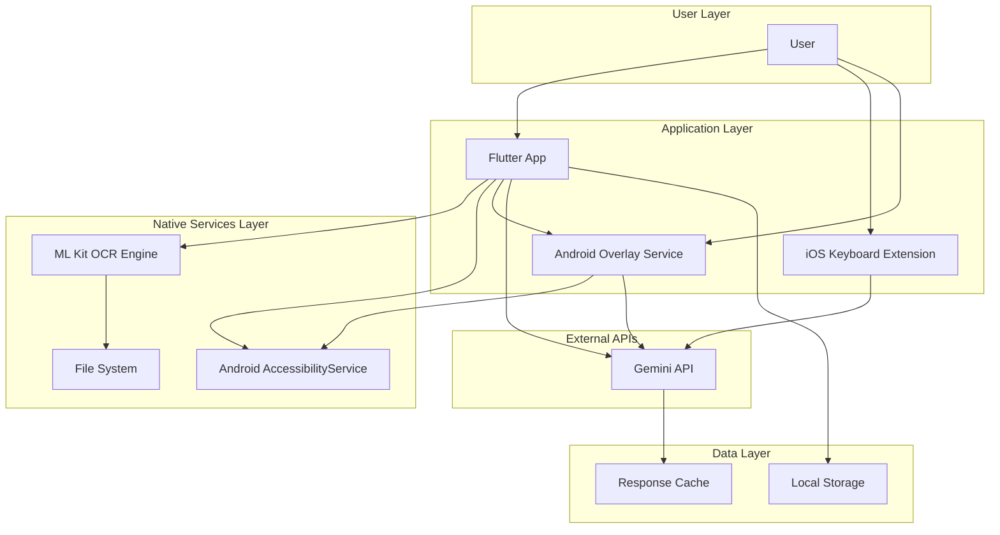
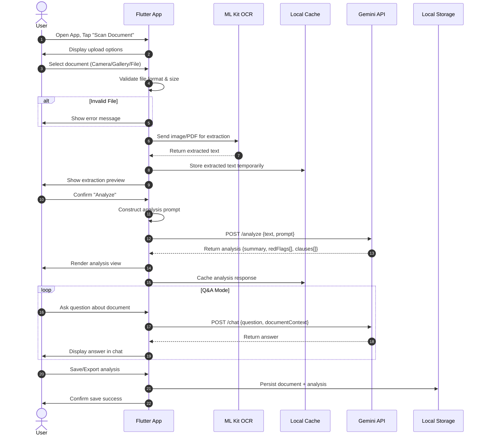
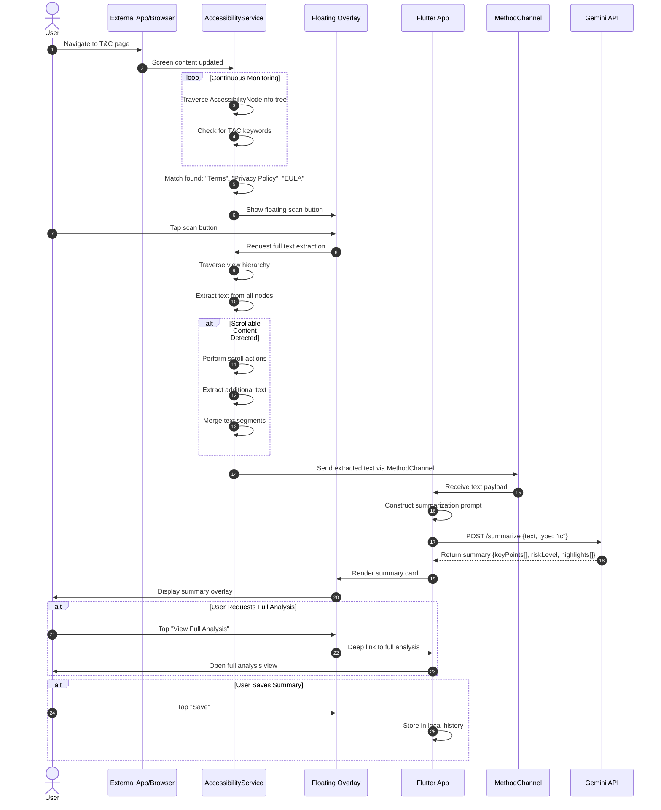
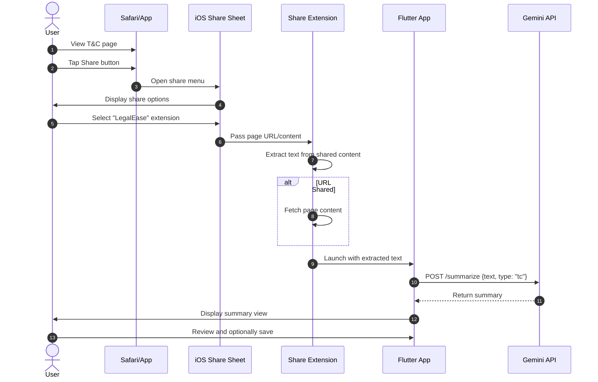
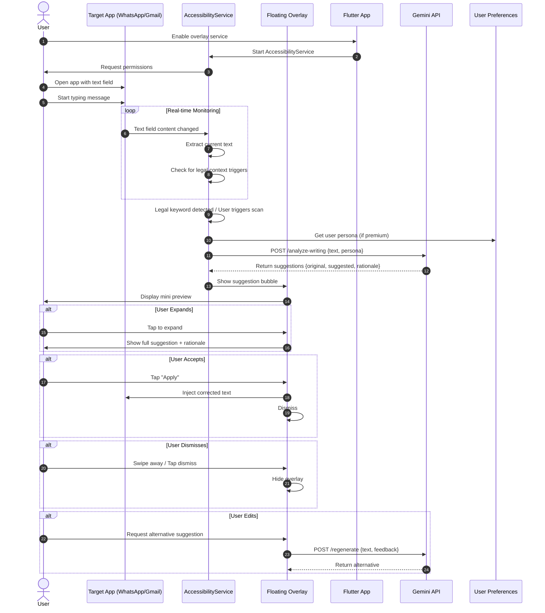
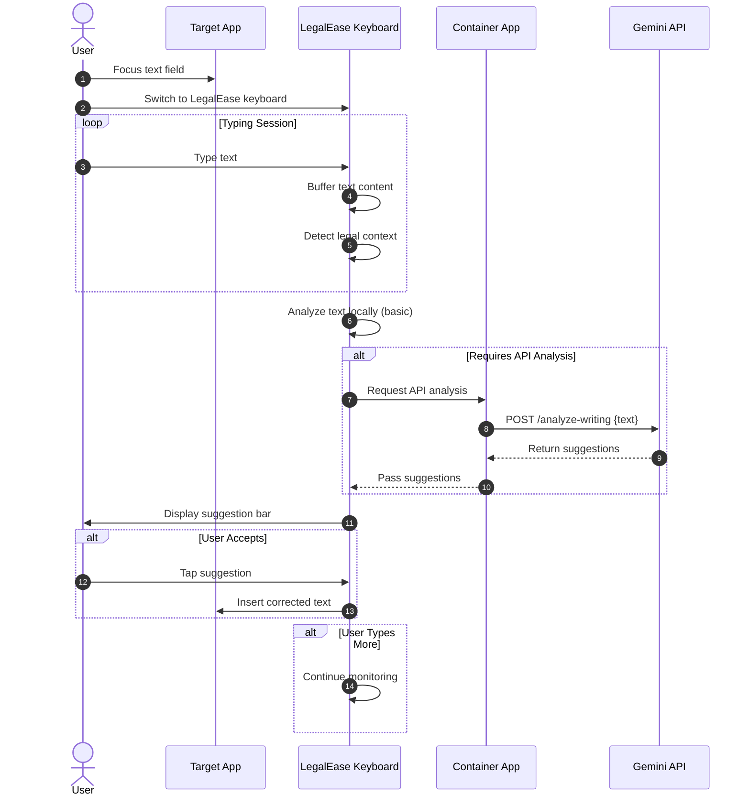
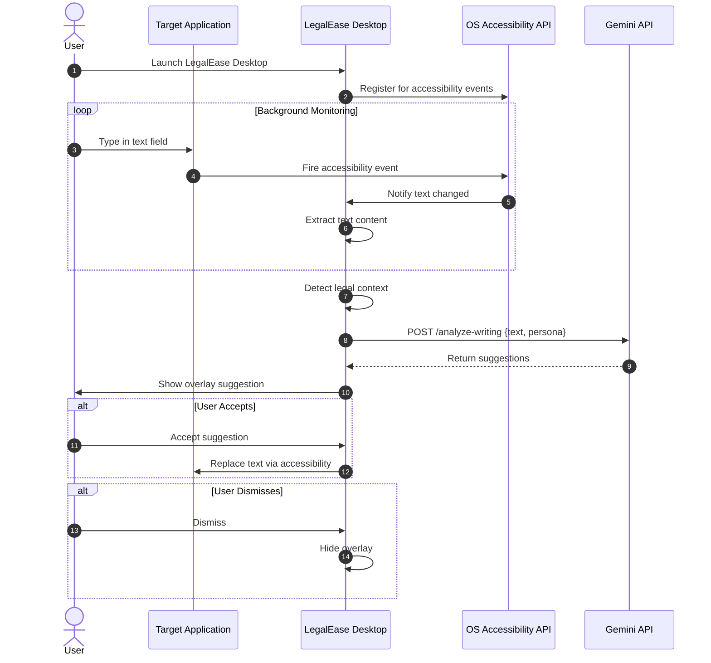
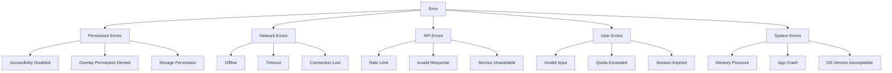

# System Sequence Document (SSD)
## LegalEase - AI Legal Assistant

**Document Version:** 1.0  
**Last Updated:** February 2026  
**Status:** Draft

---

## Table of Contents

1. [Overview](#overview)
2. [System Architecture Summary](#system-architecture-summary)
3. [Journey 1: Document Upload and Analysis](#journey-1-document-upload-and-analysis)
4. [Journey 2: On-Screen T&C Auto-Scanning](#journey-2-on-screen-tc-auto-scanning)
5. [Journey 3: Real-Time Writing Assistance](#journey-3-real-time-writing-assistance)
6. [Error Handling Summary](#error-handling-summary)
7. [Open Questions](#open-questions)

---

## Overview

This document maps out the three core user journeys for LegalEase, detailing the sequence of interactions between users, the application, native platform services, and external APIs. Each journey includes step-by-step data flows and Mermaid.js sequence diagrams.

### Key Actors

| Actor | Description |
|-------|-------------|
| **User** | End user interacting with LegalEase |
| **Flutter App** | Cross-platform application layer |
| **Native Services** | Platform-specific services (Android AccessibilityService, iOS Keyboard Extension, OCR Engine) |
| **Gemini API** | Google Gemini AI for analysis, summarization, and generation |
| **ML Kit** | Google ML Kit for OCR text extraction |
| **Local Storage** | Device-local secure storage for documents and preferences |

---

## System Architecture Summary



---

## Journey 1: Document Upload and Analysis

### Feature: Deep-Scan Document Analysis

**User Goal:** Upload a legal document (contract, lease, T&C) and receive a plain-English summary with highlighted red flags.

### Detailed Step-by-Step Sequence

| Step | Actor | Action | Data Flow |
|------|-------|--------|-----------|
| 1 | User | Opens LegalEase app and selects "Scan Document" | - |
| 2 | Flutter App | Presents upload options: Camera, Gallery, File Picker | - |
| 3 | User | Selects upload method and provides document | File path / Image data |
| 4 | Flutter App | Validates file format and size | File metadata |
| 5 | Flutter App | If image/PDF: invokes ML Kit OCR | Image bytes / PDF binary |
| 6 | ML Kit | Performs OCR text extraction | Extracted text string |
| 7 | Flutter App | Stores extracted text in local cache | Text buffer |
| 8 | Flutter App | Displays extraction preview to user | Preview UI |
| 9 | Flutter App | Sends text to Gemini API with analysis prompt | Text + system prompt |
| 10 | Gemini API | Processes document for analysis | - |
| 11 | Gemini API | Returns structured analysis: summary, red flags, clause breakdown | JSON response |
| 12 | Flutter App | Parses response and renders analysis view | UI render |
| 13 | User | Reviews highlighted red flags and summary | - |
| 14 | User | Optionally enters Q&A mode | - |
| 15 | Flutter App | Sends question + document context to Gemini API | Question + context |
| 16 | Gemini API | Returns contextual answer | Answer text |
| 17 | Flutter App | Displays answer in chat interface | Chat UI |
| 18 | Flutter App | Offers save/export options | - |

### Sequence Diagram



### Data Flow Description

```
┌─────────────────────────────────────────────────────────────────┐
│                     DOCUMENT UPLOAD FLOW                        │
├─────────────────────────────────────────────────────────────────┤
│                                                                 │
│  [User Input]                                                   │
│       │                                                         │
│       ▼                                                         │
│  ┌─────────┐    ┌──────────────┐    ┌─────────────┐            │
│  │ Camera  │───▶│ Image Bytes  │───▶│ ML Kit OCR  │            │
│  │ Gallery │    │ (JPEG/PNG)   │    │ Engine      │            │
│  │ File    │    └──────────────┘    └──────┬──────┘            │
│  └─────────┘                               │                    │
│                                            ▼                    │
│                                    ┌──────────────┐             │
│                                    │ Extracted    │             │
│                                    │ Text Buffer  │             │
│                                    │ (UTF-8)      │             │
│                                    └──────┬───────┘             │
│                                           │                     │
│  [API Request Payload]                     ▼                     │
│  ┌─────────────────────────────┐    ┌──────────────┐            │
│  │ {                           │◀───│ Text         │            │
│  │   "text": "...",            │    │ Preprocessor │            │
│  │   "analysisType": "deep",   │    └──────────────┘            │
│  │   "userId": "xxx",          │                                 │
│  │   "personaId": "default"    │                                 │
│  │ }                           │                                 │
│  └──────────────┬──────────────┘                                 │
│                 │                                                │
│                 ▼                                                │
│         ┌──────────────┐                                         │
│         │ Gemini API   │                                         │
│         │ Processing   │                                         │
│         └──────┬───────┘                                         │
│                │                                                 │
│  [API Response Payload]                                          │
│                ▼                                                 │
│  ┌─────────────────────────────────────────┐                    │
│  │ {                                       │                    │
│  │   "summary": "Plain English summary",   │                    │
│  │   "redFlags": [                         │                    │
│  │     {                                   │                    │
│  │       "text": "original clause",        │                    │
│  │       "severity": "high",               │                    │
│  │       "explanation": "why it's risky"   │                    │
│  │     }                                   │                    │
│  │   ],                                    │                    │
│  │   "clauses": [...]                      │                    │
│  │ }                                       │                    │
│  └─────────────────────────────────────────┘                    │
│                                                                 │
└─────────────────────────────────────────────────────────────────┘
```

### Error Handling Considerations

| Error Scenario | Detection | Recovery Strategy |
|----------------|-----------|-------------------|
| Invalid file format | Pre-upload validation | Display supported formats; prompt retry |
| File too large | Size check (>50MB) | Compress image; suggest lower resolution |
| OCR extraction failure | Empty/null text return | Retry with enhanced image processing; manual text entry fallback |
| Gemini API timeout | Request timeout (>30s) | Retry with exponential backoff; cached response suggestion |
| Gemini API rate limit | HTTP 429 response | Queue request; show estimated wait time |
| Network offline | Connectivity check | Cache document locally; process when online |
| Malformed API response | JSON parse failure | Display partial results; flag for re-analysis |
| Storage quota exceeded | Local storage check | Offer cloud sync; delete old documents |

---

## Journey 2: On-Screen T&C Auto-Scanning

### Feature: On-Screen T&C Auto-Scanner (Mobile)

**User Goal:** Automatically detect and summarize Terms & Conditions displayed in any app/browser without manual screenshot or download.

### Platform-Specific Implementation

| Platform | Detection Method | Text Extraction | UI Overlay |
|----------|------------------|-----------------|------------|
| Android | AccessibilityService | AccessibilityNodeInfo traversal | SYSTEM_ALERT_WINDOW |
| iOS | [REQUIRES CLARIFICATION] | Share Sheet / Safari Extension | In-app share action |

### Detailed Step-by-Step Sequence (Android)

| Step | Actor | Action | Data Flow |
|------|-------|--------|-----------|
| 1 | User | Browses to T&C page in external browser/app | - |
| 2 | Native Service | AccessibilityService monitors screen content | Screen state |
| 3 | Native Service | Detects T&C-related keywords in view hierarchy | Keyword match |
| 4 | Native Service | Displays floating "LegalEase Scan" button | Overlay render |
| 5 | User | Taps floating button to initiate scan | Tap event |
| 6 | Native Service | Traverses AccessibilityNodeInfo tree | View hierarchy |
| 7 | Native Service | Extracts all visible text content | Text segments |
| 8 | Native Service | Handles scrollable content (paginates) | Full text buffer |
| 9 | Native Service | Passes text to Flutter via MethodChannel | Text payload |
| 10 | Flutter App | Sends text to Gemini API for summarization | API request |
| 11 | Gemini API | Returns T&C summary with key points | JSON response |
| 12 | Flutter App | Renders summary in overlay card | Summary UI |
| 13 | User | Reviews summary; optionally saves to history | - |
| 14 | Flutter App | Offers "View Full Analysis" option | - |
| 15 | User | Optionally opens full app for deep analysis | Deep link |

### Sequence Diagram (Android)



### Sequence Diagram (iOS Fallback)



### Data Flow Description

```
┌─────────────────────────────────────────────────────────────────┐
│              ON-SCREEN T&C DETECTION FLOW (ANDROID)             │
├─────────────────────────────────────────────────────────────────┤
│                                                                 │
│  [AccessibilityService Monitoring]                              │
│       │                                                         │
│       ▼                                                         │
│  ┌──────────────────────────────────────────┐                  │
│  │ AccessibilityNodeInfo Tree Traversal     │                  │
│  │                                          │                  │
│  │  Root Node                               │                  │
│  │    ├── WebView                           │                  │
│  │    │     ├── TextView: "Terms of..."     │◀── Keyword Match │
│  │    │     ├── TextView: "By using..."     │                  │
│  │    │     └── ScrollView                  │                  │
│  │    │           └── [Scrollable Content]  │                  │
│  │    └── LinearLayout                      │                  │
│  └──────────────────────────────────────────┘                  │
│       │                                                         │
│       ▼                                                         │
│  ┌──────────────────────────────────────────┐                  │
│  │ Keyword Detection                         │                  │
│  │                                          │                  │
│  │ • "Terms and Conditions"                 │                  │
│  │ • "Privacy Policy"                       │                  │
│  │ • "EULA" / "End User License"            │                  │
│  │ • "Terms of Service"                     │                  │
│  │ • "Legal Agreement"                      │                  │
│  └──────────────────────────────────────────┘                  │
│       │                                                         │
│       ▼                                                         │
│  [Text Extraction Process]                                      │
│  ┌──────────────────────────────────────────┐                  │
│  │ 1. Get root node                          │                  │
│  │ 2. Recursively traverse children          │                  │
│  │ 3. Extract text from each node           │                  │
│  │ 4. Handle ACTION_SCROLL_FORWARD          │                  │
│  │ 5. Merge all text segments               │                  │
│  │ 6. Deduplicate content                   │                  │
│  └──────────────────────────────────────────┘                  │
│       │                                                         │
│       ▼                                                         │
│  [MethodChannel Bridge]                                         │
│  ┌──────────────────────────────────────────┐                  │
│  │ Native (Kotlin):                          │                  │
│  │ methodChannel.invokeMethod(              │                  │
│  │   "onTcDetected",                         │                  │
│  │   mapOf("text" to extractedText)         │                  │
│  │ )                                        │                  │
│  │                                          │                  │
│  │ Flutter (Dart):                           │                  │
│  │ methodChannel.setMethodCallHandler(      │                  │
│  │   (call) => handleTcDetection(call)      │                  │
│  │ )                                        │                  │
│  └──────────────────────────────────────────┘                  │
│                                                                 │
└─────────────────────────────────────────────────────────────────┘
```

### Error Handling Considerations

| Error Scenario | Detection | Recovery Strategy |
|----------------|-----------|-------------------|
| Accessibility service disabled | Permission check on startup | Prompt user to enable in Settings |
| Overlay permission denied | Permission check | Guide user to "Draw over apps" setting |
| No text extracted | Empty text buffer | Display "No readable content" message |
| Partial extraction (scroll failure) | Incomplete content detection | Retry with manual scroll; inform user |
| App-specific blocking | SecurityException | Fallback to manual selection/share |
| Memory pressure (large T&C) | Memory threshold | Chunk text; stream to API |
| Gemini API failure | Error response | Cache locally; retry when stable |
| User switches apps during scan | Activity change detection | Cancel scan; dismiss overlay |

### iOS Specific Constraints

Apple's sandboxing prevents global accessibility scanning. The fallback approach uses:

1. **Share Sheet Extension**: User manually shares page to LegalEase
2. **Safari Web Extension**: Inject button into Safari pages
3. **Custom Keyboard Extension**: Limited to text fields only

[REQUIRES CLARIFICATION]: Preferred iOS approach for T&C scanning - Share Sheet vs Safari Extension vs hybrid?

---

## Journey 3: Real-Time Writing Assistance

### Feature: Real-Time Legal Writing Assistant Overlay

**User Goal:** Receive real-time legal writing suggestions while composing text in any application.

### Platform Coverage

| Platform | Implementation | Permissions Required |
|----------|----------------|---------------------|
| Android | AccessibilityService + Overlay | Accessibility, Draw Over Apps |
| iOS | Custom Keyboard Extension | Full Keyboard Access |
| Windows | UI Automation API | None (app-level) |
| macOS | Accessibility API | Accessibility permission |

### Detailed Step-by-Step Sequence (Android Overlay)

| Step | Actor | Action | Data Flow |
|------|-------|--------|-----------|
| 1 | User | Enables LegalEase overlay service | Permission grant |
| 2 | Native Service | AccessibilityService starts monitoring | Service active |
| 3 | User | Opens any app with text input (WhatsApp, Gmail, etc.) | - |
| 4 | User | Begins typing legal-related content | Text input |
| 5 | Native Service | Monitors text field content via AccessibilityNodeInfo | Text buffer |
| 6 | Native Service | Detects legal context keywords or user trigger | Keyword match |
| 7 | Native Service | Extracts current text content | Text segment |
| 8 | Native Service | Sends text to Gemini API for analysis | API request |
| 9 | Gemini API | Analyzes text for legal improvements | Processing |
| 10 | Gemini API | Returns suggestions with rationale | JSON response |
| 11 | Native Service | Displays overlay bubble with suggestions | Overlay render |
| 12 | User | Reviews suggestion preview | - |
| 13 | User | Expands overlay for full suggestion | Expanded UI |
| 14 | User | Taps to accept suggestion | Accept action |
| 15 | Native Service | Injects corrected text into field | Text replacement |
| 16 | Native Service | Dismisses overlay | Overlay hidden |
| 17 | Native Service | Logs interaction for learning (opt-in) | Analytics |

### Sequence Diagram (Android)



### Sequence Diagram (iOS Keyboard Extension)



### Sequence Diagram (Desktop - Windows/macOS)



### Data Flow Description

```
┌─────────────────────────────────────────────────────────────────┐
│              REAL-TIME WRITING ASSISTANCE FLOW                  │
├─────────────────────────────────────────────────────────────────┤
│                                                                 │
│  [Text Input Detection]                                         │
│       │                                                         │
│       ▼                                                         │
│  ┌──────────────────────────────────────────┐                  │
│  │ Trigger Conditions:                       │                  │
│  │                                          │                  │
│  │ • Legal keywords detected:               │                  │
│  │   - "contract", "agreement", "liability" │                  │
│  │   - "obligation", "indemnify", "warrant" │                  │
│  │   - "termination", "breach", "clause"    │                  │
│  │                                          │                  │
│  │ • User manual trigger (double-tap, etc.) │                  │
│  │                                          │                  │
│  │ • Minimum text length reached (50 chars) │                  │
│  └──────────────────────────────────────────┘                  │
│       │                                                         │
│       ▼                                                         │
│  [API Request Payload]                                          │
│  ┌──────────────────────────────────────────┐                  │
│  │ {                                        │                  │
│  │   "text": "I want to cancel my lease",   │                  │
│  │   "context": "legal_writing",            │                  │
│  │   "persona": "polite_but_firm",          │                  │
│  │   "userId": "user_123",                  │                  │
│  │   "suggestionTypes": [                   │                  │
│  │     "tone_adjustment",                   │                  │
│  │     "legal_precision",                   │                  │
│  │     "risk_mitigation"                    │                  │
│  │   ]                                      │                  │
│  │ }                                        │                  │
│  └──────────────────────────────────────────┘                  │
│       │                                                         │
│       ▼                                                         │
│  [API Response Payload]                                         │
│  ┌──────────────────────────────────────────┐                  │
│  │ {                                        │                  │
│  │   "suggestions": [                       │                  │
│  │     {                                    │                  │
│  │       "original": "I want to cancel",    │                  │
│  │       "suggested": "I hereby request",   │                  │
│  │       "type": "formalization",           │                  │
│  │       "rationale": "More legally sound"  │                  │
│  │     }                                    │                  │
│  │   ],                                     │                  │
│  │   "riskAlerts": [                        │                  │
│  │     "Consider mentioning notice period"  │                  │
│  │   ],                                     │                  │
│  │   "confidence": 0.87                     │                  │
│  │ }                                        │                  │
│  └──────────────────────────────────────────┘                  │
│       │                                                         │
│       ▼                                                         │
│  [Text Injection (Android)]                                     │
│  ┌──────────────────────────────────────────┐                  │
│  │ 1. Get focused node                       │                  │
│  │ 2. Perform ACTION_SET_TEXT               │                  │
│  │    or                                    │                  │
│  │ 3. Perform ACTION_PASTE (clipboard)      │                  │
│  │                                          │                  │
│  │ accessibilityNode.performAction(         │                  │
│  │   AccessibilityNodeInfo.ACTION_SET_TEXT, │                  │
│  │   bundle                                 │                  │
│  │ )                                        │                  │
│  └──────────────────────────────────────────┘                  │
│                                                                 │
└─────────────────────────────────────────────────────────────────┘
```

### Error Handling Considerations

| Error Scenario | Detection | Recovery Strategy |
|----------------|-----------|-------------------|
| Accessibility permission revoked | Service binding failure | Prompt user to re-enable |
| Text field not editable | Node property check | Display suggestion as copyable text |
| API latency (>3s) | Timeout threshold | Show loading indicator; allow dismiss |
| Low confidence suggestion | Confidence score <0.6 | Label as "possible suggestion" |
| User rejects multiple suggestions | Interaction analytics | Adjust persona; reduce frequency |
| Character limit exceeded | Text length check | Truncate; analyze in chunks |
| Network unavailable | Connectivity check | Queue for later; show cached suggestions |
| Target app crashes | Exception handling | Gracefully dismiss overlay |
| Multiple overlays conflict | Z-order check | Reposition or stack overlays |

---

## Error Handling Summary

### Global Error Categories



### Error Recovery Matrix

| Category | User Communication | Auto-Retry | Fallback |
|----------|-------------------|------------|----------|
| Permission | Settings deep link | No | Disable feature |
| Network | Retry button | Yes (3x) | Cache locally |
| API | Error message | Yes (2x) | Show partial |
| User | Inline feedback | No | Request correction |
| System | Toast notification | No | Graceful degradation |

---

## Open Questions

### [REQUIRES CLARIFICATION] Items

1. **iOS T&C Scanning Approach**: Confirm whether to prioritize Share Sheet integration or Safari Web Extension development, or implement both in parallel.

2. **Persona Data Storage**: Where should user-defined personas be stored - locally on device, cloud-synced, or both? What is the fallback if cloud is unavailable?

3. **Analytics and Telemetry**: What user interaction data should be collected for improving suggestions? Is this opt-in or opt-out?

4. **Offline Capabilities**: Should any core features work offline? If so, what is the scope - cached analyses only, or limited AI processing?

5. **Document Retention Policy**: How long should scanned documents and analyses be retained? Is there a user-configurable retention setting?

6. **Cross-Device Sync**: Should documents and analyses sync across user devices? What is the sync strategy?

7. **Enterprise/B2B Features**: Are there planned features for business accounts (team sharing, admin controls, audit logs)?

8. **API Rate Limiting Strategy**: What are the specific rate limits for Gemini API calls per user tier? How should the app handle burst scenarios?

9. **Text Injection Method**: For the writing assistant, should text replacement use ACTION_SET_TEXT or clipboard paste? Consider implications for undo/redo functionality.

10. **Accessibility Service Battery Impact**: What optimization strategies should be implemented to minimize battery drain from continuous accessibility monitoring?

---

## Document Revision History

| Version | Date | Author | Changes |
|---------|------|--------|---------|
| 1.0 | February 2026 | System Design Team | Initial SSD creation |

---

*End of Document*
